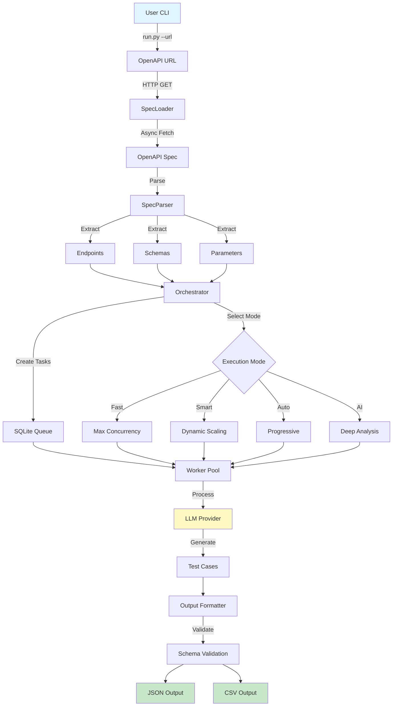
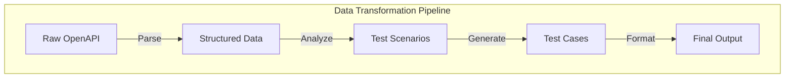
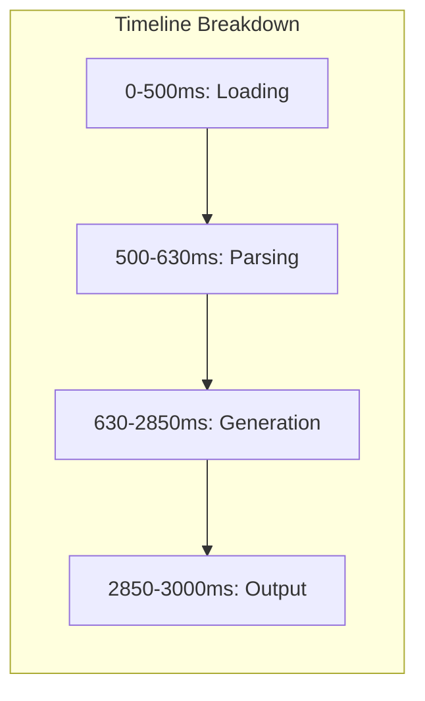
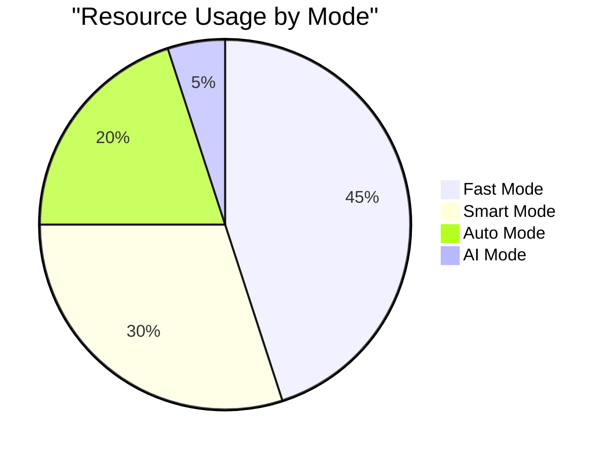
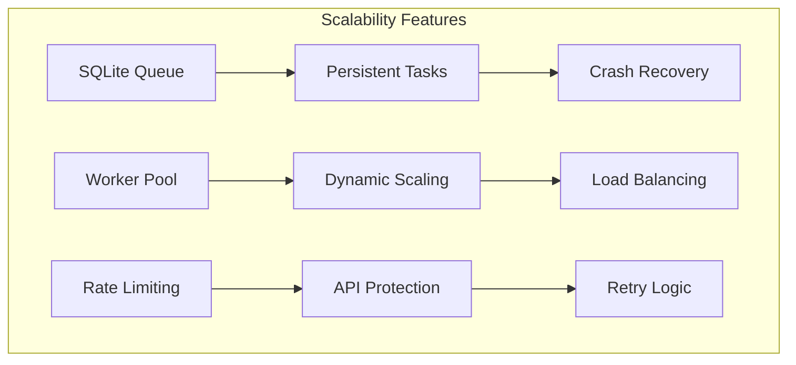

# APIForge

**Enterprise-grade API test case generator from OpenAPI specifications**

APIForge automatically analyzes your OpenAPI/Swagger specifications and generates comprehensive, structured test cases covering positive, negative, and boundary scenarios using Large Language Models (LLMs).

[](https://opensource.org/licenses/MIT)
[](https://www.python.org/downloads/)


## 🌟 Features

- **Automated Test Case Generation**: Generate comprehensive test cases from OpenAPI/Swagger specifications
- **Multiple LLM Providers**: Support for OpenAI, Custom APIs, and Qwen (with /no_think optimization for 10x speed)
- **Enterprise-Grade Architecture**: Async-first design with robust error handling and retry logic
- **Advanced Test Design Methods**: 
  - Boundary Value Analysis (BVA) - Test edge cases and limits
  - Decision Tables - Cover all logical combinations
  - State Transition - Test API state changes
  - Pairwise Testing - Optimize test combinations
  - Equivalence Partitioning - Group similar test scenarios
- **Enhanced Test Coverage**: Generates 5-20 test cases per endpoint using multiple testing strategies
- **Intelligent Task Scheduling**: 
  - SQLite-based persistent task queue
  - Dynamic worker scaling based on load
  - Progressive scheduling with API pattern matching
  - Hybrid scheduling with real-time optimization
- **Web-based Monitoring Dashboard**: 
  - Real-time progress tracking with WebSocket
  - Session management and history
  - Task retry and error tracking
  - Performance metrics and statistics
  - Export reports (CSV/JSON)
- **Multiple Output Formats**: 
  - JSON with standardized schema
  - CSV for spreadsheet tools and test management systems
  - Intermediate files for debugging
- **Production-Ready Features**:
  - Robust error handling and automatic retries
  - Rate limiting and concurrency control
  - Memory-efficient processing for large APIs
  - Graceful shutdown and task persistence
- **Extensible Provider System**: Easy to add support for new LLM providers
- **Security-First**: Secure handling of API keys and sensitive information
- **Rich CLI Interface**: Beautiful command-line interface with progress indicators

## 🚀 Quick Start

### 📦 Installation

```bash
# Clone the repository
git clone https://github.com/apiforge/apiforge.git
cd apiforge

# Install dependencies
pip install -e .
```

### ⚙️ Configuration

1. Copy the environment template:
```bash
cp .env.example .env
```

2. Configure your preferred LLM provider:

**For Qwen (Default - Fast & Free):**
```bash
LLM_PROVIDER=qwen
# No API key required, uses default endpoint
```

**For OpenAI:**
```bash
LLM_PROVIDER=openai
OPENAI_API_KEY=sk-your-openai-api-key-here
```

**For Custom API:**
```bash
LLM_PROVIDER=custom
CUSTOM_API_KEY=your-api-key
CUSTOM_BASE_URL=https://your-api.com/v1
CUSTOM_MODEL=your-model-name
```

### 🎯 Basic Usage

Generate test cases from an OpenAPI specification:

```bash
# Basic usage (uses default Qwen provider)
python run.py --url https://petstore.swagger.io/v2/swagger.json --output petstore_tests.json

# Generate test cases in CSV format for spreadsheet tools
python run.py --url https://petstore.swagger.io/v2/swagger.json --output petstore_tests.csv

# With intermediate file outputs for debugging
python run.py --url https://api.example.com/spec.json --output tests.json --intermediate

# Using a specific provider
python run.py --url https://api.example.com/spec.json --output tests.json --provider openai

# Run with different execution modes
python run.py --url https://api.example.com/spec.json --output tests.json --mode auto
# Available modes: auto (intelligent progressive), fast (maximum concurrency), 
#                  smart (dynamic scheduling), ai-analysis (AI-powered deep analysis)
```

### 📊 Monitoring Dashboard

APIForge includes a powerful monitoring dashboard for tracking test generation progress:

```bash
# Start the monitoring dashboard standalone
python run.py dashboard

# Or run generation with automatic monitoring
python run.py --url https://api.example.com/spec.json --output tests.json --monitor
```

Access the dashboard at:
- **Main Dashboard**: http://localhost:9099
- **Real-time Monitor**: http://localhost:9099/monitor
- **Error Logs**: http://localhost:9099/errors
- **Statistics**: http://localhost:9099/statistics

Features:
- Real-time progress tracking with WebSocket updates
- Session history and management
- Task status monitoring with retry capabilities
- Performance metrics and statistics
- Error tracking and analysis
- Export functionality for reports (CSV/JSON)

### 💻 Programmatic Usage

```python
import asyncio
from apiforge.orchestrator import run_generation

async def generate_tests():
    await run_generation(
        url="https://petstore.swagger.io/v2/swagger.json",
        output_path="test_suite.json"
    )

asyncio.run(generate_tests())
```

## 📖 Documentation

### 💡 Command Line Interface

```bash
# Generate test cases
python run.py --url <OPENAPI_URL> --output <OUTPUT_FILE> [OPTIONS]

# Show system information
python run.py info 

# Available options:
#   --url, -u          URL of OpenAPI specification (required)
#   --output, -o       Output file path (.json or .csv) (required)
#   --verbose, -v      Enable verbose logging
#   --provider, -p     LLM provider to use (default: qwen)
#   --intermediate     Save intermediate processing files
#   --mode, -m         Execution mode: auto|fast|smart|ai-analysis (default: auto)
#   --monitor, -M      Enable real-time monitoring dashboard
#   --help            Show help message

# Generate CSV template for manual test creation
python generate_csv_template.py --output test_template.csv
```

### ⚙️ Configuration Options

All configuration can be set via environment variables in your `.env` file:

```env
# OpenAI Configuration
OPENAI_API_KEY=sk-your-key-here
OPENAI_MODEL=gpt-4
OPENAI_MAX_TOKENS=4000
OPENAI_TEMPERATURE=0.1

# Performance Settings
MAX_CONCURRENT_REQUESTS=10
RATE_LIMIT_PER_MINUTE=100

# Output Settings
OUTPUT_FORMAT=json
OUTPUT_INDENT=2
VALIDATE_OUTPUT=true

# Logging
LOG_LEVEL=INFO
LOG_FORMAT=structured
```

### 💾 Output Formats

APITestGen supports multiple output formats:

#### JSON Format (Default)

Generates test suites in a standardized JSON format:

```json
{
  "testSuite": {
    "name": "API Test Suite",
    "description": "Automatically generated test suite",
    "baseUrl": "https://api.example.com",
    "testCases": [
      {
        "id": "TC_001",
        "name": "Create user with valid data",
        "description": "Verify successful user creation",
        "priority": "High",
        "category": "positive",
        "tags": ["users", "create"],
        "request": {
          "method": "POST",
          "endpoint": "/v1/users",
          "headers": {"Content-Type": "application/json"},
          "pathParams": {},
          "queryParams": {},
          "body": {"name": "John Doe", "email": "john@example.com"}
        },
        "expectedResponse": {
          "statusCode": 201,
          "headers": {"Content-Type": "application/json"},
          "bodySchema": {"type": "object", "properties": {...}}
        },
        "preconditions": "System is running",
        "postconditions": "User record created"
      }
    ]
  }
}
```

#### CSV Format

Export test cases in CSV format for use with spreadsheet software or test management tools:

```csv
test_id,test_name,endpoint,method,priority,category,path_params,query_params,headers,request_body,expected_status,expected_headers,expected_body,description,preconditions,postconditions,tags
TC_001,Create user with valid data,/v1/users,POST,High,positive,,,"{"Content-Type":"application/json"}","{"name":"John Doe","email":"john@example.com"}",201,"Content-Type=application/json","{"type":"object"}",Verify successful user creation,System is running,User record created,"users,create"
```

Features:
- Compatible with Excel, Google Sheets, and test management tools
- JSON encoding for complex fields
- Preserves all test case information
- Includes metadata as comments

## 🏗️ Architecture

APIForge follows a modular, enterprise-grade architecture:

### 📊 System Architecture

```
┌─────────────────────────────────────────────────────────────────────────┐
│                          APIForge System Architecture                   │
├─────────────────────────────────────────────────────────────────────────┤
│                                                                         │
│  ┌─────────────┐      ┌─────────────┐      ┌─────────────┐           │
│  │ SpecLoader  │      │ SpecParser  │      │ Generator   │           │
│  │─────────────│      │─────────────│      │─────────────│           │
│  │ • HTTP/HTTPS│─────▶│ • OpenAPI   │─────▶│ • LLM API   │           │
│  │ • Async Ops │      │ • Pydantic  │      │ • Templates │           │
│  │ • Retry     │      │ • Validation│      │ • Providers │           │
│  └─────────────┘      └─────────────┘      └─────────────┘           │
│        │                     │                     │                    │
│        └─────────────────────┴─────────────────────┘                   │
│                              │                                          │
│                    ┌─────────▼──────────┐                              │
│                    │    Orchestrator    │                              │
│                    │────────────────────│                              │
│                    │ • Task Management  │                              │
│                    │ • Concurrency Ctrl │                              │
│                    │ • Progress Tracking│                              │
│                    └─────────┬──────────┘                              │
│                              │                                          │
│        ┌─────────────────────┼─────────────────────┐                   │
│        │                     │                     │                   │
│  ┌─────▼─────┐        ┌─────▼─────┐        ┌─────▼─────┐             │
│  │  SQLite   │        │  Web UI   │        │  Output   │             │
│  │───────────│        │───────────│        │───────────│             │
│  │ • Queue   │        │ • Dashboard│        │ • JSON    │             │
│  │ • History │        │ • WebSocket│        │ • CSV     │             │
│  │ • State   │        │ • REST API │        │ • Schema  │             │
│  └───────────┘        └───────────┘        └───────────┘             │
│                                                                         │
└─────────────────────────────────────────────────────────────────────────┘
```

### 🔄 Detailed Data Flow





### ⏱️ Execution Timeline

```mermaid
gantt
    title Request Processing Timeline
    dateFormat SSS
    axisFormat %L ms

    section Initialization
    CLI Start           :done, cli, 000, 10
    HTTP Request        :done, http, 010, 490
    Parse Spec          :done, parse, 500, 90
    Create Queue        :done, queue, 590, 20
    Init Database       :done, db, 610, 10

    section Parallel Processing
    Worker 1 (/users)    :active, w1, 630, 2000
    Worker 2 (/posts)    :active, w2, 630, 1800
    Worker 3 (/comments) :active, w3, 630, 2200
    Worker N (...)       :active, wn, 630, 2000

    section Finalization
    Collect Results     :done, collect, 2850, 50
    Format Output       :done, format, 2900, 50
    Write File          :done, write, 2950, 50
```





### 🧩 Core Components

- **📄 SpecLoader**: Async HTTP client for loading OpenAPI specifications
- **📋 SpecParser**: Pydantic-based parser for extracting endpoint information
- **🤖 Generator**: Test case generation with LLM provider abstraction
- **🎭 Orchestrator**: Workflow coordination with concurrent processing
- **⚡ Task Scheduler**: SQLite-based task queue with retry logic
- **📊 Web UI**: FastAPI-based dashboard with real-time monitoring
- **🔌 Providers**: Pluggable LLM provider system (OpenAI, Qwen, Custom)

### 📈 Performance & Scalability

```mermaid
graph LR
    subgraph "Execution Modes"
        A[Fast Mode 🚀]
        B[Smart Mode 🎯]
        C[Auto Mode 📊]
        D[AI Mode 🧠]
    end
    
    subgraph "Performance Metrics"
        E[100+ endpoints/min]
        F[50-80 endpoints/min]
        G[30-60 endpoints/min]
        H[10-20 endpoints/min]
    end
    
    subgraph "Concurrency"
        I[Max 10-50 workers]
        J[Dynamic 5-20 workers]
        K[Progressive scaling]
        L[Limited 1-5 workers]
    end
    
    A --> E
    A --> I
    B --> F
    B --> J
    C --> G
    C --> K
    D --> H
    D --> L
```







### 🔀 Sequence Diagram

```mermaid
sequenceDiagram
    participant CLI
    participant SpecLoader
    participant SpecParser
    participant Orchestrator
    participant Generator
    participant LLM
    participant FileSystem

    CLI->>+SpecLoader: run.py --url spec.json
    SpecLoader->>+SpecLoader: HTTP GET
    SpecLoader-->>-SpecLoader: OpenAPI Spec
    
    SpecLoader->>+SpecParser: parse()
    SpecParser->>SpecParser: validate()
    SpecParser-->>-SpecLoader: EndpointInfo[]
    
    SpecLoader->>+Orchestrator: process_endpoints()
    
    loop For each endpoint
        Orchestrator->>+Generator: generate_test_cases()
        Generator->>+LLM: call_api(prompt)
        Note over LLM: Generate test cases<br/>based on endpoint
        LLM-->>-Generator: TestCases
        Generator-->>-Orchestrator: TestSuite
    end
    
    Orchestrator->>+FileSystem: save_output()
    FileSystem-->>-Orchestrator: ✓ Saved
    
    Orchestrator-->>-CLI: ✅ Complete!
```




## 🔧 Development

### 🔨 Setup Development Environment

```bash
# Install development dependencies
pip install -e ".[dev]"

# Run code formatting
black apiforge/
isort apiforge/

# Run type checking
mypy apiforge/

# Run linting
flake8 apiforge/
```

### 🤖 Adding New LLM Providers

1. Create a new provider class inheriting from `LLMProvider`:

```python
from apiforge.providers.base import LLMProvider

class CustomProvider(LLMProvider):
    @property
    def provider_name(self) -> str:
        return "Custom"
    
    async def generate_test_cases_async(self, endpoint: EndpointInfo) -> List[Dict]:
        # Implementation here
        pass
```

2. Register the provider:

```python
from apiforge.generator import TestCaseGenerator

TestCaseGenerator.register_provider("custom", CustomProvider)
```

### 🚀 Running Examples

```bash
# Set up environment
cp .env.example .env
# Edit .env with your API key

# Run Petstore example
cd examples
python generate_petstore_tests.py
```

## 🛡️ Security

- **API Key Management**: Never hardcode API keys; use environment variables
- **Input Validation**: Comprehensive validation of OpenAPI specifications
- **Output Sanitization**: Automatic sanitization of sensitive information in logs
- **Secure Defaults**: Security-first configuration defaults

## 🤝 Contributing

We welcome contributions! Please see our [Contributing Guidelines](CONTRIBUTING.md) for details.

### 🔄 Development Workflow

1. Fork the repository
2. Create a feature branch (`git checkout -b feature/amazing-feature`)
3. Make your changes
4. Add tests for new functionality
5. Ensure all tests pass and code is formatted
6. Commit your changes (`git commit -m 'Add amazing feature'`)
7. Push to the branch (`git push origin feature/amazing-feature`)
8. Open a Pull Request

## 📄 License

This project is licensed under the MIT License - see the [LICENSE](LICENSE) file for details.

## 🙏 Acknowledgments

- Built with [Pydantic](https://pydantic.dev/) for data validation
- Uses [httpx](https://www.python-httpx.org/) for async HTTP requests
- CLI powered by [Click](https://click.palletsprojects.com/) and [Rich](https://rich.readthedocs.io/)
- OpenAI integration via the official [OpenAI Python SDK](https://github.com/openai/openai-python)

## 📞 Support

- **💬 Issues**: [GitHub Issues](https://github.com/Devliang24/apiforge/issues)
- **💭 Discussions**: [GitHub Discussions](https://github.com/Devliang24/apiforge/discussions)
- **📧 Email**: developer.liang24@gmail.com

---

**APIForge** - Forging intelligent API tests with AI-powered automation 🚀